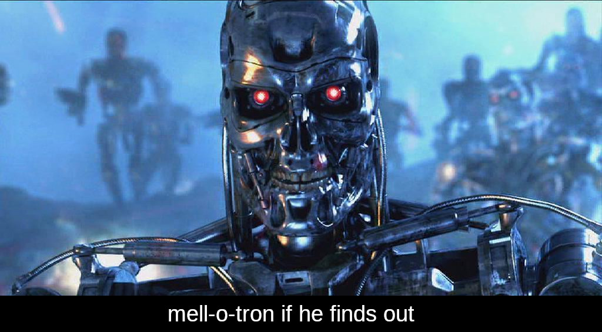

# Daedalus Community Ethical Statement

This Software is licensed under GPLv3 terms, which pretty much means you're free to do whatever you like with it (free as in freedom!).

However, there are a bunch of things we would prefer you avoid to do with this Software. The following is a non-exhaustive list.

- Our Software is not meant to be used for military purposes. If you want an OS for your killer drones, please use Microsoft Windows, not MellOS.
- Our Software is not meant to be used for mass surveillance. 
- Our Software is not meant to be used for training autonomous decision-making systems with the capability to harm individuals, communities (human and animal) and the environment.
- Our Software is not meant to be used to cause harm of any sort to any being.

Of course you're not legally bound to comply with any of this, but if we ever find out that you're using our software for these purposes, `mell-o-tron` will personally fight you with all the means available to him.

  </img>

