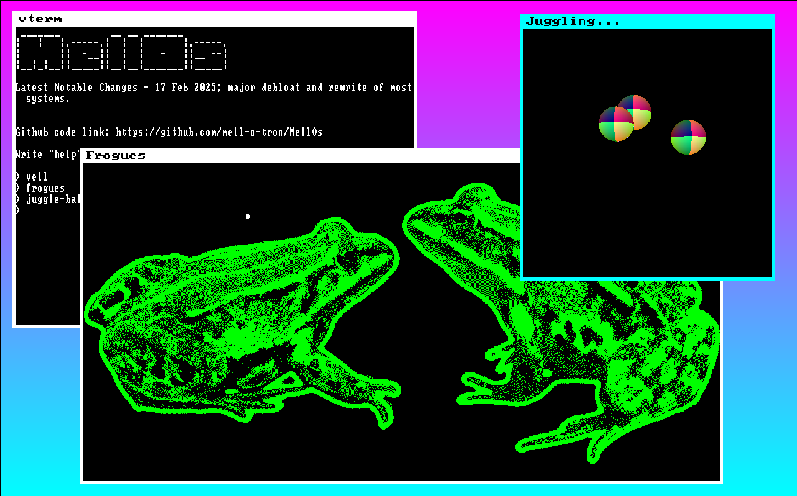

# Mellotron Kernel (MellOS)
*A minimal, collaboratively written kernel* 

  

## Why MellOS
Some ten years ago I was gifted a 1994 Compaq Presario, and I figured I could use it to learn how to write a simple operating system. In 2020 I started experimenting with some real mode programs, and eventually I moved on to writing a simple 32 bit kernel. 

During the years the project gained some traction, and there are now several wonderful people that have contributed greatly to the project.

## Some useful resources
Some of the resources I found most useful are [the OSDEV wiki](https://wiki.osdev.org/Main_Page), [osdever.net](http://www.osdever.net/tutorials/) (from which I basically stole the part regarding interrupts), this [keyboard scancode map](https://www.win.tue.nl/~aeb/linux/kbd/scancodes-1.html), and of course the most fundamental of all resources: [RTFM!!!](https://software.intel.com/content/www/us/en/develop/download/intel-64-and-ia-32-architectures-sdm-combined-volumes-3a-3b-3c-and-3d-system-programming-guide.html)

Another useful resource is the book "operating systems: principles and practice" by Thomas Anderson (no, not *that* Mr. Anderson) and Michael Dahlin. I used it to study for my OS class at university and I think it's a very good introduction to the subject.

## Docs
WIP, there should be a markdown file in each directory, which will contain the docs. If you change or add something, try to integrate your change into the docs from now on. 

### Index

- [CPU](cpu/README.md)
- [Data Structures](data_structures/README.md)
- [Disk Interface](disk_interface/README.md)
- [Drivers](drivers/README.md)
- [File System](file_system/README.md)
- [GUI](GUI/README.md)
- [Kernel](kernel/README.md)
- [Memory](memory/README.md)
- [Misc](misc/README.md)
- [Processes](processes/README.md)
- [Shell](shell/README.md)
- [Syscalls](syscalls/README.md)
- [Test](test/README.md)
- [Text Editor](text_editor/README.md)

---

## Anything-here
If you make a useful change or addition, you are allowed to use the `anything_here` file to write whatever you feel like writing; rules are: 

- You may only add content, not delete
- Be polite
- Be creative

## Features
### Current
- GRUB Multiboot 1 compliant kernel
- Interrupt request handling, keyboard and timer support
- Paging
- Dynamic memory allocation (`kmalloc`/`krealloc`/`kfree`...)
- ATA disk driver
- Simple shell
- Very, very minimal file system
- Text editor
- Minimal VESA graphics driver
- Mouse driver
- Simple floppy disk driver

### Funnies

- [Raycaster](https://github.com/Alex23087/Sperkaster) written in [perk](https://github.com/Alex23087/Perk).
- Passive juggling simulator
- Frogs :frog:

### Work in progress
- Process scheduling
- Graphics toolkit

### Future
- Spawning processes from the shell

